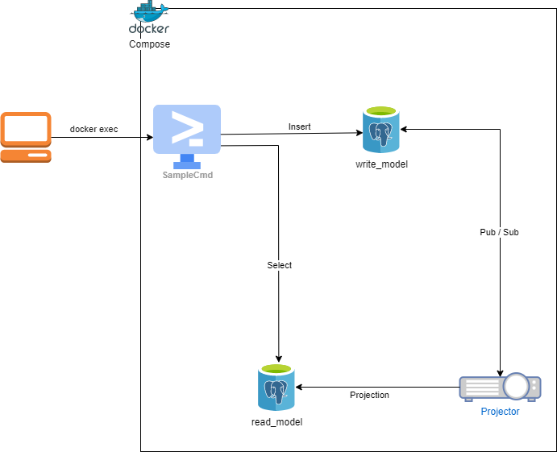

# postgres_es_sample

## image


## start
```sh:
cd src
docker-compose up -d

docker exec -it dotnet dotnet run --project /root/src/SampleCmd -e add -n sample_user_name
```

## end
```sh
cd src
docker-compose down --volumes
```